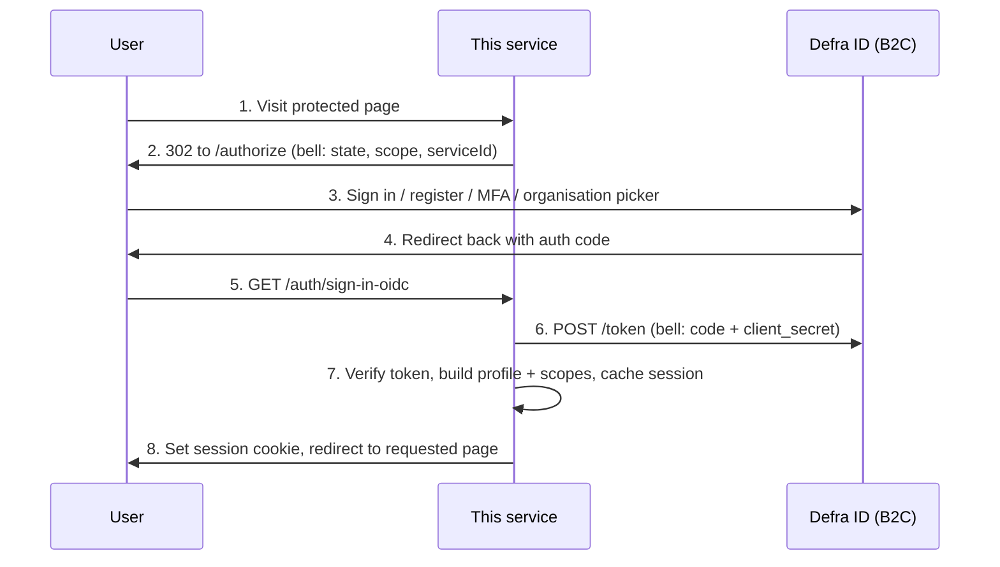

# Defra ID integration — waste-batteries-reg-frontend

The single reference for implementing Defra ID (Defra Customer Identity, "DCID") sign-in
in this repo. Written for this codebase: CDP frontend template, Hapi 21, Nunjucks,
convict config, yar + catbox (memory/Redis) session cache.

---

## 1. What Defra ID is

Defra ID is an **Azure AD B2C tenant that speaks standard OpenID Connect**, with a few
Defra-specific parameters and custom claims. There is no SDK; you do the OIDC
authorization code flow. It signs users in (via GOV.UK One Login, Government Gateway,
RPA CAP API or a trusted third party), handles registration and MFA, lets the user pick
which organisation they act for, and hands you tokens. **Authorisation is entirely your
job** — Defra ID will happily authenticate a user with no roles in your service.



**Token lifetimes to design around:**

| Thing         | Lifetime         | Consequence                                                         |
| ------------- | ---------------- | ------------------------------------------------------------------- |
| ID token      | 20 min           | Keep only for `id_token_hint` at sign-out                           |
| Access token  | random 60–90 min | Never assume 3600s — always use the `expires_in` you were given     |
| Refresh token | 24 h             | The real ceiling on a session                                       |
| B2C session   | 30 min rolling   | Users with an expired app session often sign back in with no prompt |

---

## 2. Decisions (agreed — do not relitigate)

1. **`@hapi/bell`** (strategy `defra-id`) does the redirect, state CSRF protection and
   code→token exchange. **`@hapi/cookie`** (strategy `session`) is the server-wide
   default. Endpoints come from OIDC discovery at startup — never hardcoded.
2. **[`jose`](https://github.com/panva/jose) for token verification.**
   `createRemoteJWKSet` handles `kid` selection and B2C key rotation for us.
3. **No `response_mode` parameter** — the code flow returns via the query string by
   default, which is what bell's GET callback needs. (Docs elsewhere recommend
   `form_post`, and DEFRA reference repos send `response_mode=query` explicitly — but
   the CDP stub rejects an explicit `response_mode` as an unsupported parameter, and
   the default is `query` anyway on both the stub and real B2C.)
4. **PKCE off initially.** Bell supports `provider.pkce: 'S256'` — enable once the
   stub/tenant is confirmed to support it (open question §13). Bell's `state` plus a
   confidential-client back-channel code exchange is the baseline protection; note bell's
   oauth2 protocol does not send an OIDC `nonce`.
5. **All routes protected by default** (`server.auth.default('session')`); public routes
   opt out explicitly.
6. **Cookie holds `{ sessionId }` only.** Tokens and profile live server-side in a catbox
   cache segment (memory locally, Redis deployed). Never put tokens in cookies,
   `localStorage`, or logs.
7. **Permissions from token claims only** — `roles`/`relationships` mapped to hapi
   `scope`. Single seam (`user-profile.js`) so a backend permissions API can replace it
   later.
8. **No `.env` files.** Every config key has a working local default (pointing at the
   local stub) plus an `env:` binding so CDP-injected environment variables override in
   deployed environments. Code reads config only via `config.get(…)`.
9. **yar stays** for transient pre-auth state (post-sign-in redirect path, sign-out
   state). The auth session gets its own cache segment.
10. **Organisation switching deferred** — the `/auth/organisation` route is cheap to add
    (§8) but only build the UI if journeys become org-scoped with multi-org users.

---

## 3. Onboarding (start first — it has a lead time)

The service must be registered as a Defra Service in the Common Platform Customer Master
(Dynamics 365) before anything works. Give the Defra ID / Customer Identity team, per
environment:

- sign-in redirect URI: `https://<service>.<env>.cdp-int.defra.cloud/auth/sign-in-oidc`
- post-logout redirect URI: `https://<service>.<env>.cdp-int.defra.cloud/auth/sign-out-oidc`
- `http://localhost:3000/auth/sign-in-oidc` (+ sign-out) — Defra ID allows localhost callbacks
- confirmation you need only the `code` flow

They return, per environment: `client_id`, `client_secret`, `serviceId`, and the OIDC
configuration URL. Redirect URIs must match **exactly** — scheme, port, path.

Ask at the same time: (a) does this service use the **B2C organisation picker**? If not,
`relationships`/`roles` claims are omitted unless the user has exactly one relationship;
(b) what is the **policy** value and is a `p` parameter required (§13).

---

## 4. Dependencies

Pinned exact versions (repo rule — no ranges); vet and note versions in the PR:

- `@hapi/bell` — OAuth2/OIDC client strategy
- `@hapi/cookie` — session cookie strategy
- `jose` — JWKS fetch + RS256 JWT verification
- `@hapi/crumb` — CSRF on forms (recommended alongside auth)

No HTTP client dependency — use native `fetch`.

---

## 5. Config — extend `src/config/config.js`

Add a `defraId` block. Local defaults point at the local cdp-defra-id-stub so
`docker compose up` + `npm run dev` works with zero setup:

```js
defraId: {
  discoveryUrl: {
    doc: 'Defra ID OIDC .well-known/openid-configuration URL',
    format: String,
    default:
      'http://localhost:3200/cdp-defra-id-stub/.well-known/openid-configuration',
    env: 'DEFRA_ID_DISCOVERY_URL'
  },
  clientId: {
    // The stub's built-in oidc.clientId — it hardcodes this as the `aud` of
    // every token it issues regardless of the client_id sent, so token
    // verification only passes when our clientId matches it
    doc: 'Defra ID client id',
    format: String,
    default: '63983fc2-cfff-45bb-8ec2-959e21062b9a',
    env: 'DEFRA_ID_CLIENT_ID'
  },
  clientSecret: {
    doc: 'Defra ID client secret',
    format: String,
    default: 'test_value',
    sensitive: true,
    env: 'DEFRA_ID_CLIENT_SECRET'
  },
  serviceId: {
    doc: 'Defra ID service id (non-standard OIDC param, required)',
    format: String,
    default: 'stub-service-id',
    env: 'DEFRA_ID_SERVICE_ID'
  },
  scopes: {
    doc: 'OAuth scopes. Real Defra ID also needs the client_id scope for an access token; the CDP stub rejects it — override per environment',
    format: Array,
    default: ['openid', 'offline_access'],
    env: 'DEFRA_ID_SCOPES'
  },
  policy: {
    doc: 'B2C policy — sent as the `p` provider param when set (confirm with Defra ID team)',
    format: String,
    nullable: true,
    default: null,
    env: 'DEFRA_ID_POLICY'
  },
  callbackBaseUrl: {
    doc: 'Public base URL used to build both callback URLs, no trailing slash',
    format: String,
    default: 'http://localhost:3000',
    env: 'DEFRA_ID_CALLBACK_BASE_URL'
  }
}
```

Reuse the existing `session.cookie.password` (≥32 chars) as the single secret for bell,
cookie and yar — do not add a second one. In deployed environments `clientSecret` and
`session.cookie.password` come from **CDP service secrets** (platform env vars), never
`app-config`, never a committed real value.

---

## 6. File layout (repo conventions, colocated tests)

```
src/
  config/config.js                     # + defraId block (above)
  server/
    auth/                              # new
      get-oidc-config.js               # fetch + cache discovery document
      get-bell-options.js              # bell strategy options
      get-cookie-options.js            # cookie strategy options incl. validate + refresh
      verify-token.js                  # jose JWKS RS256 verification
      refresh-tokens.js                # POST token_endpoint, form-encoded body
      user-profile.js                  # parse relationships/roles claims → profile + scope
      get-safe-redirect.js             # open-redirect guard
      *.test.js
    plugins/
      auth.js                          # registers bell + cookie, sets default('session')
      no-store.js                      # cache-control: no-store on authenticated pages
    routes/
      auth/
        index.js                       # the five auth routes
        controller.js
      unauthorised/                    # "could not sign you in" + "no access" views
  server/common/templates/layouts/page.njk   # + sign in/out nav, user name
```

---

## 7. Implementation

### 7.1 Discovery

```js
// src/server/auth/get-oidc-config.js
import { config } from '#/config/config.js'

let cached = null

export async function getOidcConfig() {
  if (cached) return cached

  const url = config.get('defraId.discoveryUrl')
  const response = await fetch(url)
  if (!response.ok) {
    throw new Error(`Defra ID discovery failed: ${response.status} from ${url}`)
  }

  const doc = await response.json()
  const required = [
    'issuer',
    'authorization_endpoint',
    'token_endpoint',
    'jwks_uri',
    'end_session_endpoint'
  ]
  for (const key of required) {
    if (!doc[key])
      throw new Error(`Defra ID discovery document missing "${key}"`)
  }

  cached = doc
  return cached
}
```

Called during plugin registration, so a bad URL fails the deployment, not the first user.

### 7.2 Bell strategy (sign-in)

> **The `scope` trap.** Against **real Defra ID** the scope must be
> `openid offline_access <client_id>` — your own `client_id` as the third value is the
> B2C convention for "issue me an access token for this app". Omit it and you get an ID
> token but no usable access token, with no obvious error. `offline_access` is what gets
> you the refresh token. The **CDP stub rejects** the `client_id` scope as unsupported,
> so the scope list is config (`defraId.scopes`): stub-compatible
> `['openid', 'offline_access']` by default, real environments set
> `DEFRA_ID_SCOPES=openid,offline_access,<client_id>`.

> **`serviceId` is a required non-standard parameter.** No OIDC library knows about it —
> it goes through bell's `providerParams`.

```js
// src/server/auth/get-bell-options.js
import { config } from '#/config/config.js'
import { verifyToken } from './verify-token.js'
import { buildUserProfile } from './user-profile.js'
import { getSafeRedirect } from './get-safe-redirect.js'

export function getBellOptions(oidcConfig) {
  const clientId = config.get('defraId.clientId')

  return {
    provider: {
      name: 'defra-id',
      protocol: 'oauth2',
      useParamsAuth: true,
      auth: oidcConfig.authorization_endpoint,
      token: oidcConfig.token_endpoint,
      scope: config.get('defraId.scopes'),
      profile: async function (credentials, params) {
        // Verify signature + iss/aud/exp before trusting a single claim
        const claims = await verifyToken(credentials.token)
        credentials.profile = buildUserProfile(claims, params.id_token)
      }
    },
    clientId,
    clientSecret: config.get('defraId.clientSecret'),
    password: config.get('session.cookie.password'),
    isSecure: config.get('session.cookie.secure'),
    // Lax — bell's transaction cookie must survive the redirect back from the IdP
    isSameSite: 'Lax',
    location: function (request) {
      if (request.query.redirect) {
        // yar-backed so it survives the round trip to the IdP
        request.yar.flash('redirect', getSafeRedirect(request.query.redirect))
      }
      return `${config.get('defraId.callbackBaseUrl')}/auth/sign-in-oidc`
    },
    // No response_mode param: the code flow returns via the query string by
    // default (which is what bell's GET callback needs), and the CDP stub
    // rejects an explicit response_mode as an unsupported parameter
    providerParams: function (request) {
      const params = {
        serviceId: config.get('defraId.serviceId')
      }
      const policy = config.get('defraId.policy')
      if (policy) params.p = policy
      if (request.path === '/auth/organisation') params.forceReselection = true
      return params
    }
  }
}
```

### 7.3 Token verification

Never decode-without-verify in production code. If verification fails against the stub,
log the token's actual `iss`/`aud` and align expectations with that environment's
discovery document — do not "fix" it by skipping verification.

```js
// src/server/auth/verify-token.js
import { createRemoteJWKSet, jwtVerify } from 'jose'
import { config } from '#/config/config.js'
import { getOidcConfig } from './get-oidc-config.js'

let jwks = null

async function getJwks() {
  if (!jwks) {
    const oidcConfig = await getOidcConfig()
    // Caches keys, refetches on unknown kid — handles B2C signing-key rotation
    jwks = createRemoteJWKSet(new URL(oidcConfig.jwks_uri))
  }
  return jwks
}

export async function verifyToken(token) {
  const oidcConfig = await getOidcConfig()
  const { payload } = await jwtVerify(token, await getJwks(), {
    issuer: oidcConfig.issuer,
    audience: config.get('defraId.clientId'),
    algorithms: ['RS256'],
    clockTolerance: 60
  })
  return payload
}
```

### 7.4 Claims → profile and scopes

The custom claims (beyond standard `sub`/`iss`/`aud`/`exp`/`iat`/`nbf`):

| Claim                                      | Meaning                                                                               |
| ------------------------------------------ | ------------------------------------------------------------------------------------- |
| `sub`                                      | User's unique B2C id — your stable user key                                           |
| `contactId`                                | Contact id in Dynamics 365                                                            |
| `email`, `firstName`, `lastName`           | Identity basics                                                                       |
| `uniqueReference`                          | Human-readable reference the user can quote to support                                |
| `loa` / `aal`                              | Level of assurance (GPG45, 0–3) / auth strength (1 = password, 2 = +MFA)              |
| `amr`                                      | How they signed in: `one` One Login, `scp` Govt Gateway, `cap` RPA, `ttp` third party |
| `correlationId`, `sessionId`               | Log both — they link events across the B2C journey/session                            |
| `enrolmentCount` / `enrolmentRequestCount` | Enrolments / pending requests across **all** organisations                            |
| `currentRelationshipId`                    | The organisation relationship the user selected                                       |
| `relationships`, `roles`                   | Colon-delimited strings — parse as below                                              |

`relationships` and `roles` are **arrays of colon-delimited strings**, not objects, and
may be absent entirely (no picker + multiple relationships). Organisation names can
contain colons — split on fixed field positions, not blindly:

```
relationships[n] = relationshipId:organisationId:organisationName:organisationLoa:relationship:relationshipLoa
roles[n]         = relationshipId:roleName:status
```

Role `status`: `1` incomplete, `2` pending, `3` **complete/approved — the only value that
grants access**, `4` rejected, `5` blocked, `6` access removed, `7` offboarded.

```js
// src/server/auth/user-profile.js

// Fixed fields from each end; the middle remainder is the name
export function parseRelationship(value) {
  const parts = String(value).split(':')
  if (parts.length < 6) return null

  const [relationshipId, organisationId] = parts
  const [organisationLoa, relationship, relationshipLoa] = parts.slice(-3)

  return {
    relationshipId,
    organisationId,
    organisationName: parts.slice(2, -3).join(':'),
    organisationLoa: Number(organisationLoa),
    relationship, // Citizen | Employee | Agent
    relationshipLoa: Number(relationshipLoa)
  }
}

export function parseRole(value) {
  const parts = String(value).split(':')
  if (parts.length < 3) return null

  const status = Number(parts.at(-1))
  return {
    relationshipId: parts[0],
    roleName: parts.slice(1, -1).join(':'),
    status,
    isActive: status === 3
  }
}

export function buildUserProfile(claims, idToken) {
  const relationships = (claims.relationships ?? [])
    .map(parseRelationship)
    .filter(Boolean)
  const roles = (claims.roles ?? []).map(parseRole).filter(Boolean)
  const current =
    relationships.find(
      (r) => r.relationshipId === claims.currentRelationshipId
    ) ?? null

  // Only roles at the CURRENT relationship, only status 3
  const currentRoles = roles
    .filter(
      (r) => r.relationshipId === claims.currentRelationshipId && r.isActive
    )
    .map((r) => r.roleName)

  return {
    id: claims.sub,
    contactId: claims.contactId,
    correlationId: claims.correlationId,
    tokenSessionId: claims.sessionId,
    email: claims.email,
    firstName: claims.firstName,
    lastName: claims.lastName,
    displayName: [claims.firstName, claims.lastName].filter(Boolean).join(' '),
    uniqueReference: claims.uniqueReference,
    loa: claims.loa,
    aal: Number(claims.aal),
    enrolmentCount: claims.enrolmentCount ?? 0,
    enrolmentRequestCount: claims.enrolmentRequestCount ?? 0,
    currentRelationshipId: claims.currentRelationshipId ?? null,
    organisationId: current?.organisationId ?? null,
    organisationName: current?.organisationName ?? null,
    relationships,
    roles,
    idToken, // kept only for id_token_hint at sign-out
    // hapi route authorisation reads credentials.scope
    scope: ['user', ...currentRoles]
  }
}
```

> **Authorise on current-relationship roles, not the whole `roles` array.** A user may
> hold a role at organisation A while acting for organisation B. This is the most common
> real authorisation bug in Defra ID integrations — the `scope` built above already
> enforces it.

A user can authenticate with **no roles at all**. That user gets a "you don't have access
to this service yet" page (§11), not a 403.

### 7.5 Refresh

```js
// src/server/auth/refresh-tokens.js
import { config } from '#/config/config.js'
import { getOidcConfig } from './get-oidc-config.js'

export async function refreshTokens(refreshToken) {
  const oidcConfig = await getOidcConfig()
  const clientId = config.get('defraId.clientId')

  // Credentials in the form-encoded BODY, never the query string (URLs leak into logs)
  const response = await fetch(oidcConfig.token_endpoint, {
    method: 'POST',
    headers: { 'content-type': 'application/x-www-form-urlencoded' },
    body: new URLSearchParams({
      client_id: clientId,
      client_secret: config.get('defraId.clientSecret'),
      grant_type: 'refresh_token',
      scope: config.get('defraId.scopes').join(' '),
      refresh_token: refreshToken
    })
  })

  if (!response.ok) {
    throw new Error(`Defra ID token refresh failed: ${response.status}`)
  }
  return response.json()
}
```

### 7.6 Cookie strategy (session validation + proactive refresh)

Refresh ~1 minute before expiry inside `validate`, so no request ever fails on an expired
access token. Refresh failure (refresh token expired/revoked) drops the session and the
strategy redirects to sign-in cleanly.

```js
// src/server/auth/get-cookie-options.js
import { config } from '#/config/config.js'
import { refreshTokens } from './refresh-tokens.js'
import { verifyToken } from './verify-token.js'
import { buildUserProfile } from './user-profile.js'

const refreshWindowMs = 60 * 1000

export function getCookieOptions() {
  return {
    cookie: {
      name: 'userSession',
      password: config.get('session.cookie.password'),
      path: '/',
      ttl: config.get('session.cookie.ttl'),
      isSecure: config.get('session.cookie.secure'),
      // Lax, not Strict — the cookie must survive the redirect back from the IdP
      isSameSite: 'Lax'
    },
    keepAlive: true,
    redirectTo: (request) =>
      `/auth/sign-in?redirect=${encodeURIComponent(request.url.pathname + request.url.search)}`,
    validate: async function (request, session) {
      const cached = await request.server.app.cache.get(session.sessionId)
      if (!cached) return { isValid: false }

      // Absolute cap from sign-in — token refresh and cookie keepAlive are
      // both rolling, so without this a session could live as long as the
      // refresh token (24 h). Fails closed on a missing/invalid createdAt.
      const ageMs = Date.now() - Date.parse(cached.createdAt)
      if (Number.isNaN(ageMs) || ageMs > config.get('session.absoluteTtl')) {
        await request.server.app.cache.drop(session.sessionId)
        return { isValid: false }
      }

      if (Date.parse(cached.expiresAt) - Date.now() > refreshWindowMs) {
        return { isValid: true, credentials: cached }
      }

      try {
        const tokens = await refreshTokens(cached.refreshToken)
        const claims = await verifyToken(tokens.access_token)
        const updated = {
          ...cached,
          ...buildUserProfile(claims, tokens.id_token),
          accessToken: tokens.access_token,
          // B2C may not rotate the refresh token; keep the old one if it doesn't
          refreshToken: tokens.refresh_token ?? cached.refreshToken,
          expiresAt: new Date(
            Date.now() + Number(tokens.expires_in) * 1000
          ).toISOString()
        }
        await request.server.app.cache.set(session.sessionId, updated)
        return { isValid: true, credentials: updated }
      } catch (error) {
        request.logger.info(
          `Defra ID refresh failed, dropping session: ${error.message}`
        )
        await request.server.app.cache.drop(session.sessionId)
        return { isValid: false }
      }
    }
  }
}
```

### 7.7 Auth plugin and server wiring

```js
// src/server/plugins/auth.js
import bell from '@hapi/bell'
import cookie from '@hapi/cookie'

import { getOidcConfig } from '../auth/get-oidc-config.js'
import { getBellOptions } from '../auth/get-bell-options.js'
import { getCookieOptions } from '../auth/get-cookie-options.js'

export const auth = {
  plugin: {
    name: 'auth',
    register: async function (server) {
      await server.register([bell, cookie])
      const oidcConfig = await getOidcConfig()
      server.auth.strategy('defra-id', 'bell', getBellOptions(oidcConfig))
      server.auth.strategy('session', 'cookie', getCookieOptions())
      server.auth.default('session')
    }
  }
}
```

In `src/server/server.js`:

```js
// After hapi.server({...}):
server.app.cache = server.cache({
  cache: config.get('session.cache.name'), // existing catbox (memory/Redis)
  segment: 'defra-id-session',
  expiresIn: config.get('session.cache.ttl')
})

// Register order: sessionCache (yar) and auth BEFORE router; crumb = @hapi/crumb
await server.register([..., sessionCache, auth, crumb, ..., router])
```

Two wiring notes:

- **Add `isSameSite: 'Lax'` to the existing yar plugin's `cookieOptions`**
  (`src/server/plugins/session-cache.js`). hapi's default is `Strict`, which drops the
  yar cookie — and with it the post-sign-in redirect path and sign-out state — on the
  redirect back from the IdP.
- CDP Redis uses an ioredis `keyPrefix` — verify catbox-redis + prefix interplay with a
  quick integration test (keys land under `waste-batteries-reg-frontend:`).

### 7.8 Routes

```js
// src/server/routes/auth/index.js — registered by the existing router plugin
import {
  signInOidcController,
  signOutController,
  signOutOidcController
} from './controller.js'

export const authRoutes = [
  {
    method: 'GET',
    path: '/auth/sign-in',
    // Bell intercepts and redirects to Defra ID; handler runs only post-auth edge cases
    options: { auth: 'defra-id' },
    handler: (_request, h) => h.redirect('/')
  },
  {
    method: 'GET',
    path: '/auth/sign-in-oidc',
    options: { auth: { strategy: 'defra-id', mode: 'try' } },
    handler: signInOidcController
  },
  {
    method: 'GET',
    path: '/auth/sign-out',
    options: { auth: { mode: 'try' } },
    handler: signOutController
  },
  {
    method: 'GET',
    path: '/auth/sign-out-oidc',
    options: { auth: false },
    handler: signOutOidcController
  },
  {
    method: 'GET',
    path: '/auth/organisation', // org re-selection; providerParams adds forceReselection
    options: { auth: 'defra-id' },
    handler: (_request, h) => h.redirect('/')
  }
]
```

```js
// src/server/routes/auth/controller.js
import { randomUUID } from 'node:crypto'

import { config } from '#/config/config.js'
import { getOidcConfig } from '../../auth/get-oidc-config.js'

export async function signInOidcController(request, h) {
  if (!request.auth.isAuthenticated) {
    // Log detail, render none of it (§11)
    request.logger.warn(
      `Defra ID sign-in failed: ${request.auth.error?.message}`
    )
    return h.view('unauthorised/index').code(401)
  }

  const { profile, token, refreshToken, expiresIn } = request.auth.credentials
  const sessionId = randomUUID() // fresh id on every sign-in — prevents fixation

  await request.server.app.cache.set(sessionId, {
    ...profile,
    sessionId,
    accessToken: token,
    refreshToken,
    createdAt: new Date().toISOString(),
    expiresAt: new Date(Date.now() + Number(expiresIn) * 1000).toISOString()
  })

  request.cookieAuth.set({ sessionId })
  request.logger.info(
    `User authenticated (correlationId ${profile.correlationId})`
  )

  return h.redirect(request.yar.flash('redirect')?.at(0) ?? '/')
}

export async function signOutController(request, h) {
  if (!request.auth.isAuthenticated) return h.redirect('/')

  const session = request.auth.credentials
  const oidcConfig = await getOidcConfig()

  // State so a third party can't forge the post-logout callback
  const state = randomUUID()
  request.yar.flash('signOutState', state)

  // Drop local session now — the callback may never arrive
  await request.server.app.cache.drop(session.sessionId)
  request.cookieAuth.clear()

  const url = new URL(oidcConfig.end_session_endpoint)
  url.search = new URLSearchParams({
    id_token_hint: session.idToken,
    post_logout_redirect_uri: `${config.get('defraId.callbackBaseUrl')}/auth/sign-out-oidc`,
    state
  }).toString()

  return h.redirect(url.toString())
}

export function signOutOidcController(request, h) {
  const expected = request.yar.flash('signOutState')?.at(0)
  if (!expected || request.query.state !== expected) {
    request.logger.warn('Post-logout callback with unrecognised state')
  }
  // Fail-safe: session is already gone; clear the cookie again and land somewhere neutral
  request.cookieAuth.clear()
  return h.redirect('/')
}
```

Sign-out notes: `id_token_hint` is required for `post_logout_redirect_uri` to be
honoured; if the ID token has expired (20 min) the user lands on a generic Defra services
list instead — acceptable, the local session is already destroyed. If the resulting URL
ever hits browser length limits, switch to a tiny auto-submitting form POST to
`end_session_endpoint`.

### 7.9 Safe redirect guard

```js
// src/server/auth/get-safe-redirect.js
// "//evil.example" and "/\evil.example" are both absolute to a browser
export function getSafeRedirect(value) {
  if (typeof value !== 'string') return '/'
  if (!value.startsWith('/')) return '/'
  if (value.startsWith('//') || value.startsWith('/\\')) return '/'
  return value
}
```

### 7.10 Route sweep (default is now authenticated)

Explicit opt-outs when `server.auth.default('session')` lands:

| Route                                              | Setting                                                               |
| -------------------------------------------------- | --------------------------------------------------------------------- |
| `/health`                                          | `auth: false` — platform probe, must stay public                      |
| Static assets / `serveStaticFiles` / vite dev path | `auth: false`                                                         |
| `/auth/*`, as defined in §7.8                      | as defined                                                            |
| `/`, `/about` and other public pages               | `auth: { mode: 'try' }` (page renders either way, nav reflects state) |
| Account/service pages                              | default (`session`), plus `options.auth.access.scope` e.g. `['user']` |

### 7.11 No-store headers and CSP

- `src/server/plugins/no-store.js`: an `onPreResponse` ext setting
  `cache-control: no-store` on authenticated HTML responses (not `/public` assets, not
  `/health`) — stops back-button access after sign-out.
- Check the blankie CSP config allows redirects to the Defra ID host; add `formAction`
  for the Defra ID host only if a form ever posts there (not needed with the default
  query response mode).

### 7.12 Views and navigation

- Extend `src/config/nunjucks/context/context.js`: when `request.auth.isAuthenticated`,
  expose an `auth` object (`displayName`, `organisationName`, `isAuthenticated`) to
  views. Guard with try/catch so a cache failure doesn't 500 every page.
- `page.njk` layout: signed-in user's name + "Sign out" link when authenticated, "Sign
  in" otherwise (GOV.UK header / service navigation patterns). Never render token
  contents.
- Link to the **Account Management App** for account self-service:
  `https://your-account.<env>.cui.defra.gov.uk/management` (no params — it authenticates
  the user itself).

---

## 8. Organisation switching (deferred — hooks only)

The `/auth/organisation` route (§7.8) re-authenticates with `forceReselection=true`,
which is the only switching mechanism. Show a switch link when:

- `relationships.length > 1`, or
- `enrolmentCount > roles.length` (roles at an unselected organisation), or
- `enrolmentRequestCount >` number of relationships without matching roles

Switching issues a **new session with different scopes** — anything cached against the
old organisation must be discarded, and in-progress work generally should not survive the
switch. `relationshipId` can be sent as a provider param to pre-select an organisation
(deep links). Build the UI only when journeys need it.

---

## 9. Environments and local development

| Environment                     | Identity provider                                                                                           |
| ------------------------------- | ----------------------------------------------------------------------------------------------------------- |
| Local                           | cdp-defra-id-stub via docker compose (default config), or real Defra ID with whitelisted localhost callback |
| CDP `dev`                       | CDP Defra ID stub                                                                                           |
| CDP `test`, `perf-test`, `prod` | Real Defra ID                                                                                               |

Nothing in code changes between these — only the `DEFRA_ID_*` env overrides and secrets.
No `if (env === …)` branches anywhere in the auth path.

**Add the stub to `compose.yml`** on the `cdp-tenant` network (confirm exact image
name/port/env from [DEFRA/cdp-defra-id-stub](https://github.com/DEFRA/cdp-defra-id-stub)
when implementing):

```yaml
cdp-defra-id-stub:
  image: defradigital/cdp-defra-id-stub:latest
  ports:
    - '3200:3200'
  environment:
    PORT: 3200
  networks:
    - cdp-tenant
```

Stub well-known URLs: `http://localhost:3200/cdp-defra-id-stub/.well-known/openid-configuration`
locally, and `https://cdp-defra-id-stub.<env>.cdp-int.defra.cloud/cdp-defra-id-stub/...`
in `dev`/`test`/`perf-test`. You cannot point a laptop at a _deployed_ stub — run it
locally or be deployed alongside it.

Real Defra ID OIDC metadata (for reference; the actual URL comes from onboarding):
`https://your-account.<cpdev|cptst|pre|''>.cui.defra.gov.uk/idphub/b2c/<policy>/.well-known/openid-configuration`

Corporate firewalls need `https://*.access.service.gov.uk` and `https://*.account.gov.uk`
allow-listed (wildcards included) for the sign-in journey.

---

## 10. Sessions — TTL decisions

- `session.absoluteTtl` (4 h) is the hard ceiling, enforced via the `createdAt`
  check in `validate` — cache TTL and cookie `keepAlive` are both rolling, so
  without it a refresh chain could keep a session alive for the refresh token's
  full 24 h.
- Cookie TTL = cache TTL (both 4 h in config) act as the rolling/idle window
  within that cap. A shorter idle timeout (GDS pattern: idle 30 m / absolute 4 h)
  is a config change to `session.cookie.ttl` + `session.cache.ttl` if wanted.
- Sessions are per-browser; B2C's own 30 min rolling session means users may sign back
  in without seeing a login form. That is expected.

---

## 11. Error handling

Defra ID shows its own pages for some failures (managed errors, maintenance, B2C
misconfig like a bad `client_id`) — the user never returns to you. For errors that do
reach you:

- **Callback errors / token exchange failures** — log the full OIDC `error`,
  `error_description` and `correlationId`; render a **generic** "We could not sign you
  in" page with a retry link. No OIDC detail, ever, in the response.
- Three distinct user-facing pages:
  1. **Couldn't sign you in** (callback failure) → retry link to `/auth/sign-in`
  2. **Signed in, no access to this service** (authenticated, empty `currentRoles`) →
     how to request enrolment
  3. **Signed in, not allowed to do this** (has roles, missing the required scope) →
     hapi 403 via the existing `catchAll` error helper, GOV.UK-styled
- Extend the pino `log.redact` paths so no token, `id_token_hint`, `code` or claim PII
  is ever logged.

---

## 12. Testing

Unit tests colocated, ≥90% coverage, negative paths included:

- `parseRelationship` / `parseRole`: valid, malformed, organisation names containing
  colons, absent claims entirely
- `buildUserProfile`: scopes only from current relationship + `status === 3`; roles held
  at a _different_ relationship than current are excluded
- `getSafeRedirect`: `//evil.example`, `/\evil.example`, `https://evil.example`, missing,
  and a legitimate `/some/path?q=1`
- `verify-token` with a locally generated RSA keypair + fake JWKS: wrong signature,
  wrong `aud`, wrong `iss`, expired, wrong `kid` each rejected (these tests are what stop
  an authentication bypass shipping)
- cookie `validate`: missing session / valid / near-expiry+refresh success /
  refresh failure → invalid + session dropped
- refresh-tokens: body is form-encoded, secret never in URL
- routes: each auth route authenticated + unauthenticated + tampered sign-out state;
  `/health` stays public; protected route redirects with the original path in
  `?redirect=`; 403 when scope missing

Integration tests use the stub's API (also the basis for performance tests):

```
POST /cdp-defra-id-stub/API/register                    # create user with chosen relationships/roles
GET  /cdp-defra-id-stub/API/register/{userId}
POST /cdp-defra-id-stub/API/register/{userId}/expire    # force token expiry — test refresh without waiting an hour
```

Journey tests worth having: sign in → land on originally requested page; sign out → back
button requires sign-in again; user with no roles sees the "no access" page.

Gate every phase with `npm run git:pre-commit-hook`.

---

## 13. Confirm during onboarding (open questions)

1. **Policy / `p` param** — required for this tenant? Value? (It also determines SSO
   grouping with other Defra services sharing the policy.)
2. **PKCE** — supported by the cdp-defra-id-stub and the real tenant for confidential
   clients? If yes, turn on `provider.pkce: 'S256'`.
3. **Claims shape** — does this service's registration use the B2C organisation picker,
   and which claims does it actually return (`roles`, `relationships`,
   `currentRelationshipId`)? Inspect a stub token early.
4. **Stub specifics** — exact image name, port and env for `compose.yml`.
5. **Redirect URIs** registered per environment, exactly as in §3.

---

## 14. Security checklist (acceptance criteria)

- [ ] Signature verified against JWKS, `algorithms: ['RS256']` pinned, `iss`/`aud`/`exp` checked — no decode-without-verify anywhere
- [ ] Tokens server-side only; cookie holds an opaque `sessionId`, `httpOnly` (hapi default), `Secure` in environments, `path=/`
- [ ] Session, bell and yar cookies all `SameSite=Lax` — `Strict` silently breaks the IdP round trip
- [ ] Session id regenerated on every sign-in
- [ ] Post-login redirect restricted to relative single-slash paths
- [ ] `client_secret` + cookie password from CDP secrets; no real values in repo
- [ ] Authorisation uses current-relationship roles with `status === 3` only
- [ ] OIDC error detail logged, never rendered; no tokens/codes/claims PII in logs (pino redact extended)
- [ ] Refresh failure clears the session and returns the user to sign-in cleanly
- [ ] Sign-out destroys the local session _and_ calls `end_session_endpoint` with `id_token_hint`; post-logout callback state validated
- [ ] `no-store` on authenticated pages (back button after sign-out)
- [ ] `/health` public; every other route protected unless explicitly opted out

---

## 15. PR slicing

Each slice independently shippable (nothing user-visible until PR4):

1. **PR1** — deps + config `defraId` block + auth cache segment (no behaviour change)
2. **PR2** — `src/server/auth/*` helpers with tests (pure modules, unused yet)
3. **PR3** — auth plugin + routes + unauthorised views (default **not** yet switched)
4. **PR4** — `server.auth.default('session')` + route sweep + no-store + 403 page
5. **PR5** — compose stub wiring + README local-dev docs

---

## 16. References

| Repo                                                                            | Why                                                                                                   |
| ------------------------------------------------------------------------------- | ----------------------------------------------------------------------------------------------------- |
| [cdp-defra-id-demo](https://github.com/DEFRA/cdp-defra-id-demo)                 | Smallest complete CDP example — same stack as this plan (bell, cookie, Redis sessions)                |
| [fcp-defra-id-example](https://github.com/DEFRA/fcp-defra-id-example)           | The structure this plan's auth modules mirror (we fix its `keys[0]` kid bug and query-string secrets) |
| [fcp-defra-id-stub](https://github.com/DEFRA/fcp-defra-id-stub)                 | Best reference for safety details: Lax cookies, safe redirects, sign-out state                        |
| [cdp-defra-id-stub](https://github.com/DEFRA/cdp-defra-id-stub)                 | The local stub + its register/find/expire APIs                                                        |
| [marine-licensing-frontend](https://github.com/DEFRA/marine-licensing-frontend) | Frontend passing the access token to a backend API                                                    |

Authoritative docs: Defra ID technical onboarding guide, Overview v1.1 —
[local PDF copy](cdp-docs/defra-id-with-cdp/Technical%20onboarding%20guide%20for%20core%20service%20-%20Overview%20v1.1.pdf),
[original wiki page](https://dev.azure.com/defragovuk/DEFRA-Common-Platform-Improvements/_wiki/wikis/DEFRA-Common-Platform-Improvements.wiki/97504/Technical-onboarding-guide-for-core-service);
CDP portal docs — [local markdown copy](cdp-docs/defra-id-with-cdp/defra-id-with-cdp.md)
(contains the Customer Identity SharePoint link).

Ownership: the Defra ID / Customer Identity team owns registration, redirect URIs,
`serviceId`, secrets, MFA/AAL and the picker; the CDP team owns the stub and service
secrets. Questions about token contents go to Defra ID, not CDP.

---

## 17. Appendix — endpoint inventory

Every endpoint this integration exposes or calls. (Not an OpenAPI spec on purpose: these
are browser navigations returning 302s/HTML, not a JSON API. If a backend API is added
later, that service is where an OpenAPI spec earns its place.)

### Exposed by this service (all browser GETs)

| Path                  | Auth                   | In                                    | Out                                                              | Spec     |
| --------------------- | ---------------------- | ------------------------------------- | ---------------------------------------------------------------- | -------- |
| `/auth/sign-in`       | `defra-id` (bell)      | `?redirect=` relative path (optional) | 302 to Defra ID `/authorize`                                     | §7.8     |
| `/auth/sign-in-oidc`  | `defra-id`, mode `try` | `?code=&state=` from Defra ID         | session cookie + 302 to requested page, or 401 unauthorised view | §7.8     |
| `/auth/sign-out`      | mode `try`             | —                                     | 302 to Defra ID `end_session_endpoint` (or `/` if signed out)    | §7.8     |
| `/auth/sign-out-oidc` | none                   | `?state=` from Defra ID               | 302 to `/`                                                       | §7.8     |
| `/auth/organisation`  | `defra-id`             | —                                     | 302 to `/authorize` with `forceReselection=true`                 | §7.8, §8 |
| `/health`             | none (unchanged)       | —                                     | 200                                                              | §7.10    |

### Called by this service (all discovered from `defraId.discoveryUrl` — never hardcoded)

| Endpoint                 | Method              | Caller                                              | Purpose                                                               | Spec       |
| ------------------------ | ------------------- | --------------------------------------------------- | --------------------------------------------------------------------- | ---------- |
| discovery URL (config)   | GET                 | `get-oidc-config.js`, at startup                    | fetch the five endpoints below                                        | §7.1       |
| `authorization_endpoint` | GET (browser 302)   | bell                                                | start the code flow (+ `serviceId`)                                   | §7.2       |
| `token_endpoint`         | POST (form-encoded) | bell (code exchange); `refresh-tokens.js` (refresh) | tokens                                                                | §7.2, §7.5 |
| `jwks_uri`               | GET                 | `verify-token.js` (jose, cached)                    | signature verification keys                                           | §7.3       |
| `end_session_endpoint`   | GET (browser 302)   | sign-out controller                                 | IdP sign-out (+ `id_token_hint`, `post_logout_redirect_uri`, `state`) | §7.8       |

### Stub-only test API (local / `dev`, never production)

| Endpoint                                          | Method | Purpose                                                   |
| ------------------------------------------------- | ------ | --------------------------------------------------------- |
| `/cdp-defra-id-stub/API/register`                 | POST   | create a test user with chosen relationships/roles        |
| `/cdp-defra-id-stub/API/register/{userId}`        | GET    | look up a test user                                       |
| `/cdp-defra-id-stub/API/register/{userId}/expire` | POST   | force token expiry — test refresh without waiting an hour |
